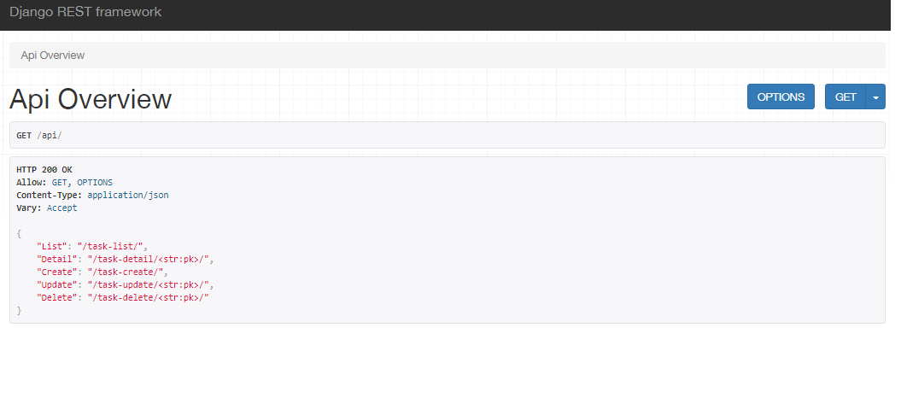

# Django Rest Framework

It is used to transfer data through different platforms with the help of rest api.

## This Project includes following rest api operation :-

- Create : create new task api 
- Update : update particular task api
- Delete : delete particular task api
- List   : shows all tasks api

## Screenshots of project

**Api_Overview** _To shows all api urls._

**Task_List** _To shows all tasks api._

**Task_Create** _To create task api._

**Task_Update** _To update particular task api._

**Api_Delete** _To delete particular api._


## Code of api views

```Python
from django.shortcuts import render
from django.http import JsonResponse
from .serializers import TaskSerializer
from .models import Task
# Important rest_framework imports
from rest_framework.decorators import api_view
from rest_framework.response import Response

# Create your views here.

@api_view(['GET'])
def apiOverview(request):

    api_urls = {
        'List':'/task-list/',
        'Detail':'/task-detail/<str:pk>/',
        'Create':'/task-create/',
        'Update':'/task-update/<str:pk>/',
        'Delete':'/task-delete/<str:pk>/',
    }
    return Response(api_urls)

@api_view(['GET'])
def taskList(request):
    tasks = Task.objects.all()
    serializer = TaskSerializer(tasks, many=True)
    return Response(serializer.data)

@api_view(['GET'])
def taskDetail(request,pk):
    tasks = Task.objects.get(id=pk)
    serializer = TaskSerializer(tasks, many=False)
    return Response(serializer.data)


@api_view(['POST'])
def taskCreate(request):
    serializer = TaskSerializer(data=request.data)

    if serializer.is_valid():
        serializer.save()


    return Response(serializer.data)

@api_view(['POST'])
def taskUpdate(request,pk):
    tasks = Task.objects.get(id=pk)
    serializer = TaskSerializer(data=request.data)

    if serializer.is_valid():
        serializer.save()

    return Response(serializer.data)

@api_view(['DELETE'])
def taskDelete(request,pk):
    task = Task.objects.get(id=pk)
    task.delete()

    return Response("Succesfully Deleted")
```